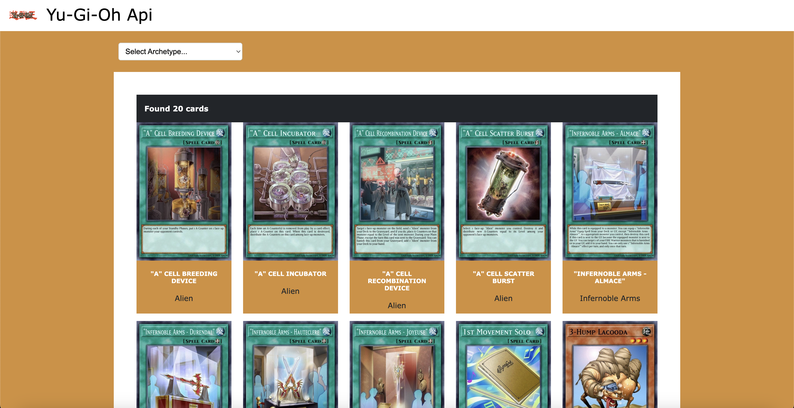

# Vite Yu-Gi-Oh

In this project I get data from an API to populate a grid of Yu-Gi-Oh cards. I use props and state management to pass the data to where it is needed.  
I use an $emit to pass an event from MainArchetype.vue to its parent Main.vue, and I use a function to call the API with the relevant parameters on page load and each time the value of the archetype selector changes, returning all cards by default and the cards filtered by archetype if one is selected (note that, in order to reduce call times, I've limited the results to a maximum of 20 cards).

To use the application simply select the desired archetype and you'll see the first 20 cards of that archetype.

## Default View

## Filtered View

